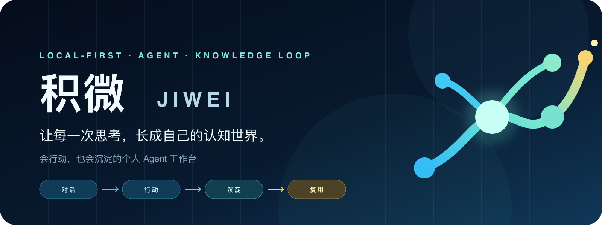
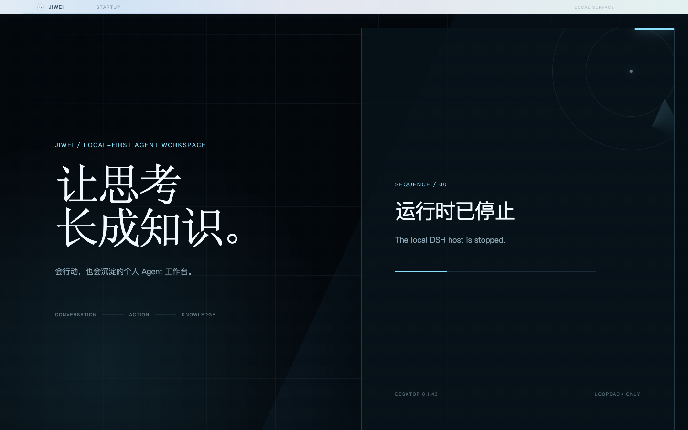
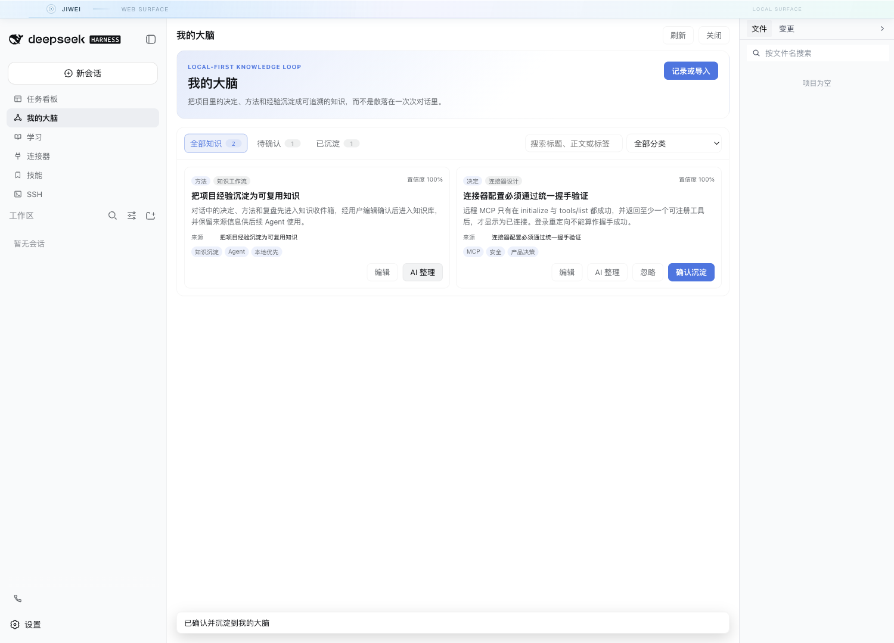
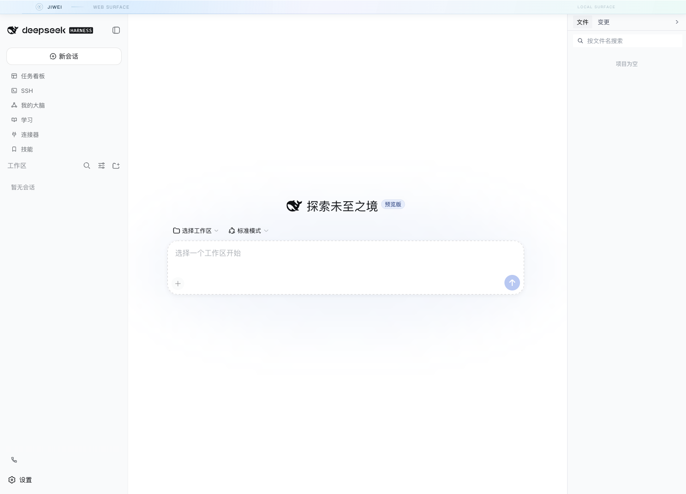
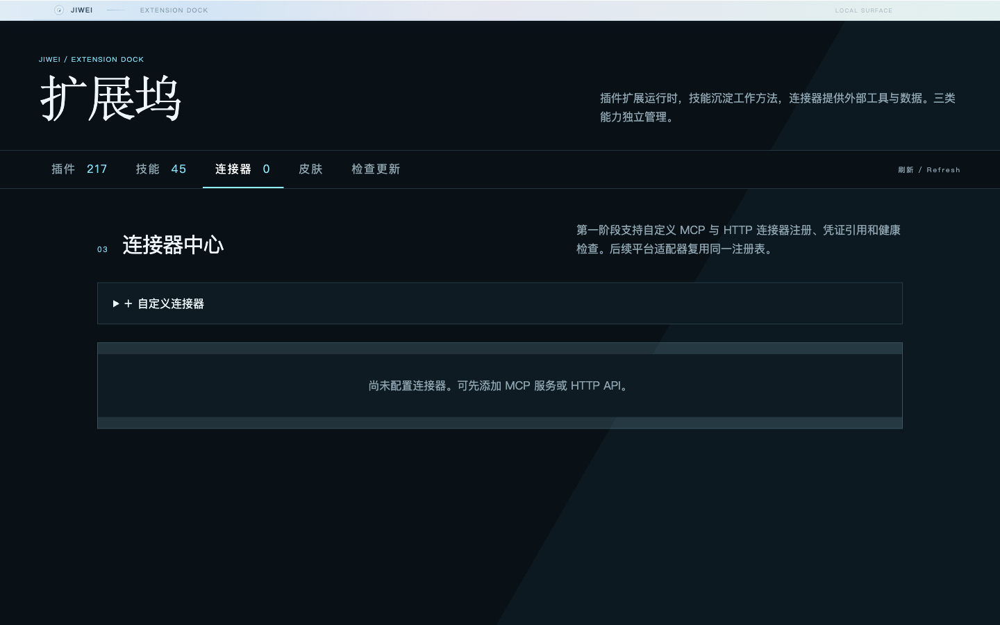

# JIWEI · 积微

[中文](README.md) · [English](README.en.md)



> A personal Agent workspace that acts and remembers.

JIWEI brings AI conversations, tool execution, project context, and personal knowledge into one local-first workspace. It uses DeepSeek Harness as its Agent runtime and adds desktop delivery, native file attachments, connector workflows, observable orchestration, and the “My Brain” knowledge loop.

This is an independent community project, not an official DeepSeek product. The JIWEI brand, product design, desktop integration, and new features are maintained here. DeepSeek, Harness, and related marks belong to their respective owners.

[Latest release](https://github.com/jerry-yu95/deepseek-harness-desktop/releases/latest) · [Installation](docs/install.en.md) · [Changelog](CHANGELOG.md) · [Security](SECURITY.md)

Current version: `0.1.43` · Embedded runtime: `@deepseek-ai/dsh 0.1.1-rc.2`

## Why JIWEI

Most AI products end when a conversation ends. Sources stay in transcripts, tool configuration stays fragmented across clients, and useful project experience is hard to call back later.

JIWEI is built around a continuous cognition loop:

```text
conversation and sources → Agent action → human confirmation → knowledge → reuse
```

The goal is not another button-heavy chat box. It is a workspace where newcomers can use Agents at low cost while understanding, correcting, and accumulating their results.

## Product today

| Isolated local runtime | “My Brain” knowledge loop |
| --- | --- |
|  |  |
| **Files, conversations, and projects** | **Skills and connector dock** |
|  |  |

These screenshots were generated from this repository with isolated local data and contain no live accounts or secrets. The DeepSeek Harness surface shown inside the workspace belongs to the integrated upstream runtime and does not make JIWEI an official distribution.

## Core capabilities

### Native attachments

- Drag, paste, or choose a file and the composer shows a native file reference—not an opaque ID, tool protocol, or the whole document.
- The Agent reads bounded pages only when needed, preserving context quality.
- JSON, JSONC, YAML, Markdown, TXT, CSV, XML, DOCX, XLSX, and PPTX are supported. PNG, JPEG, WebP, and GIF stay on the runtime image path.
- Sensitive configuration is redacted before Host RPC. `.env`, key files, archives, PDF, legacy Office, and unreliable content fail closed.

### Diagnosable connectors

- Paste provider `mcpServers` JSON, select a local `mcp.json`, or discover selected Agent-client configurations.
- Known providers map to their catalog entry; unknown servers remain named custom connectors.
- Remote MCP is usable only after both `initialize` and `tools/list` succeed and expose a tool. An HTTP 302 login redirect is not a successful handshake.
- Configuration, credentials, runtime, and Harness registration are diagnosed separately. Secrets are encrypted in the desktop main process and excluded from records, logs, and exports.
- An Agent can stage a connector import directly from an attachment instead of searching user directories or unpacking applications.

Live authorization still depends on provider protocol, network, account, and permissions. A catalog entry or structurally valid configuration is not a claim of end-to-end account verification.

### “My Brain” knowledge loop

- Decisions, methods, and retrospectives first enter an inbox; the user edits and confirms them before deposit.
- Pending and deposited knowledge share one searchable view with editing, ignore actions, categories, and tags.
- Supports pasted content, public URLs, and a WeChat Official Account adapter with bounded DNS, redirect, type, and size policies.
- If static WeChat access is blocked, an isolated browser restricted to exact WeChat content hosts can complete verification without weakening the generic importer.
- AI refinement is explicitly initiated and uses a model already configured in the client. Source and provenance remain local, and output still requires confirmation.

### Observable desktop Agent runtime

- DeepSeek Harness remains responsible for the Agent Loop, model adapters, permissions, and Cordis plugin semantics.
- Standard, adaptive, and enhanced orchestration expose model health, token use, context pressure, cache hits, and execution traces.
- An isolated `desktop` profile avoids overwriting existing DSH settings, and the runtime binds to loopback by default.
- Windows x64, macOS Intel, and Apple Silicon builds include sanitized logs, crash recovery, configuration backup, and update rollback.

## Architecture boundary

| Layer | Maintainer | Responsibility |
| --- | --- | --- |
| JIWEI product layer | This project | Desktop shell, attachments, connector workflows, knowledge loop, brand, and UX |
| Harness runtime layer | Official DeepSeek dependencies | Agent Loop, models, permissions, MCP client, workflows, and plugin host |
| Compatibility layer | This project and attributed third parties | Optional task, Git, SSH, mobile, and UI extensions |

This boundary lets JIWEI follow upstream runtime releases without presenting community capabilities as official features. The desktop application ID remains compatible for seamless preview-build upgrades; the product name, icon, packages, and public presentation use JIWEI.

## Install

Download the matching artifact from [Releases](https://github.com/jerry-yu95/deepseek-harness-desktop/releases/latest):

| Platform | Artifact |
| --- | --- |
| Windows 10/11 x64 | `JIWEI-Setup-<version>-x64.exe` |
| Intel Mac | `JIWEI-<version>-x64.dmg` |
| Apple Silicon Mac | `JIWEI-<version>-arm64.dmg` |

Public builds are currently unsigned and may be reported as an unknown publisher. Download only from this repository and verify against `SHA256SUMS.txt` in the same release. See the [installation guide](docs/install.en.md).

## Develop locally

Requires Node.js 22+ and pnpm 11:

```sh
git clone https://github.com/jerry-yu95/deepseek-harness-desktop.git
cd deepseek-harness-desktop
pnpm install
pnpm test
pnpm typecheck
pnpm build
pnpm --filter @harness-design/desktop dev
```

## Privacy, license, and contribution

- Local-first and loopback-only by default; remote capability requires explicit opt-in.
- Source paths do not enter conversation prose; file reads are bounded and connector credentials are encrypted.
- URL ingestion rejects private networks, mixed DNS, unsafe redirects, and oversized responses.
- Report security issues privately as described in [SECURITY.md](SECURITY.md).

The repository is BSD-3-Clause licensed; see [LICENSE](LICENSE). It includes components from the earlier `dsh-web-ui` collection and other open-source packages. Required copyrights, licenses, and provenance remain in [NOTICE.md](NOTICE.md) and package-level license files. Attribution does not imply endorsement or reuse of third-party branding, promotional copy, or screenshots.

Issues and pull requests are welcome. Please provide reproducible, sanitized evidence and read [CONTRIBUTING.md](CONTRIBUTING.md).
