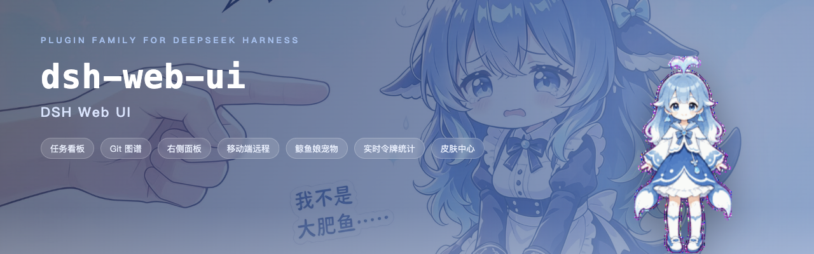
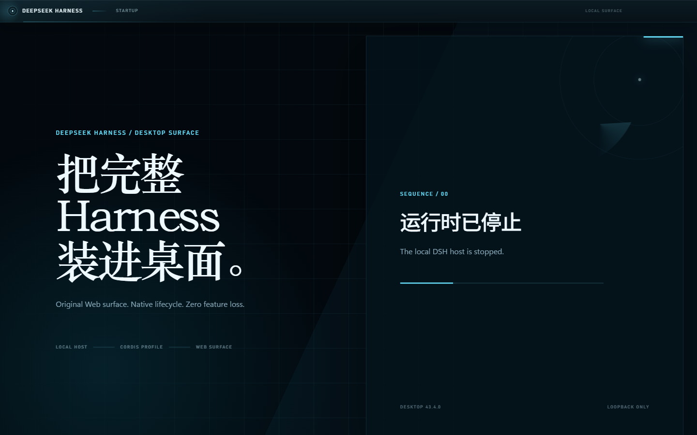
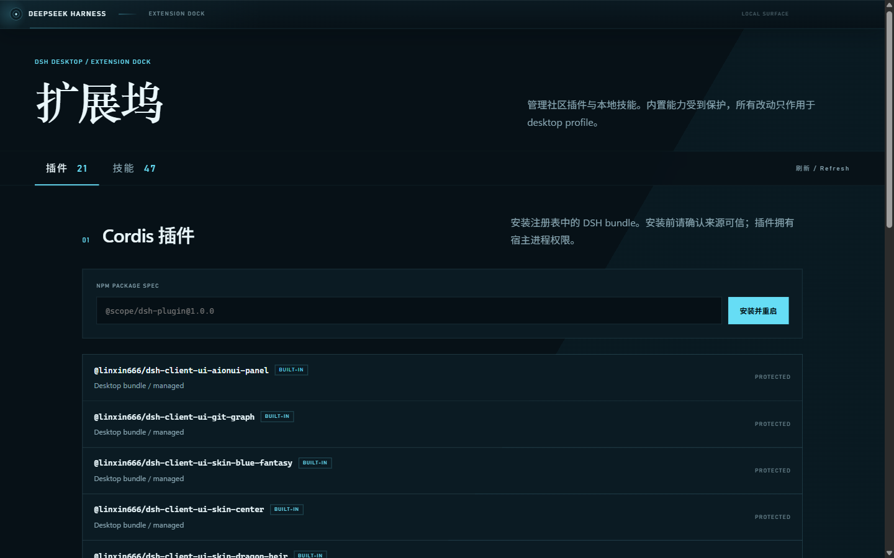
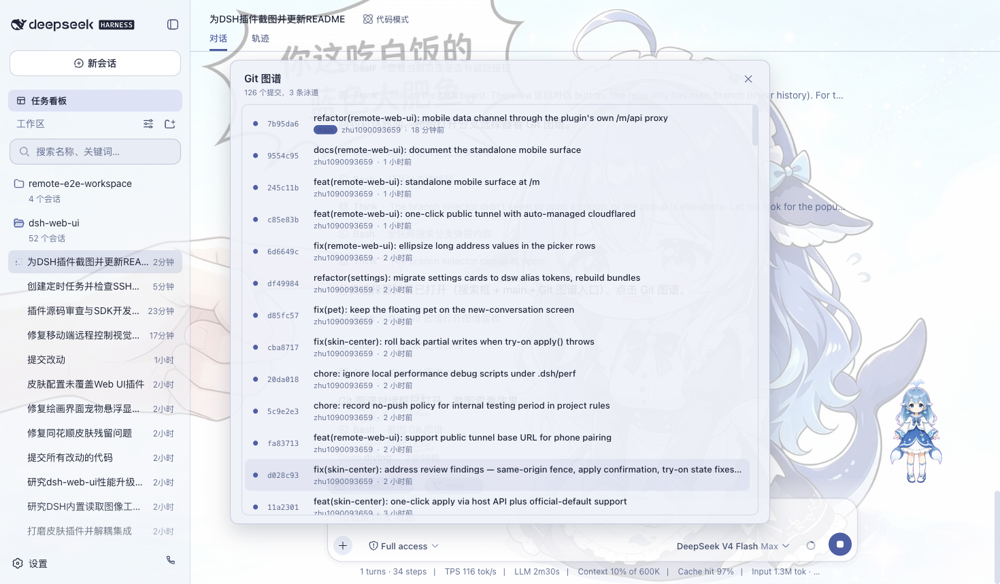
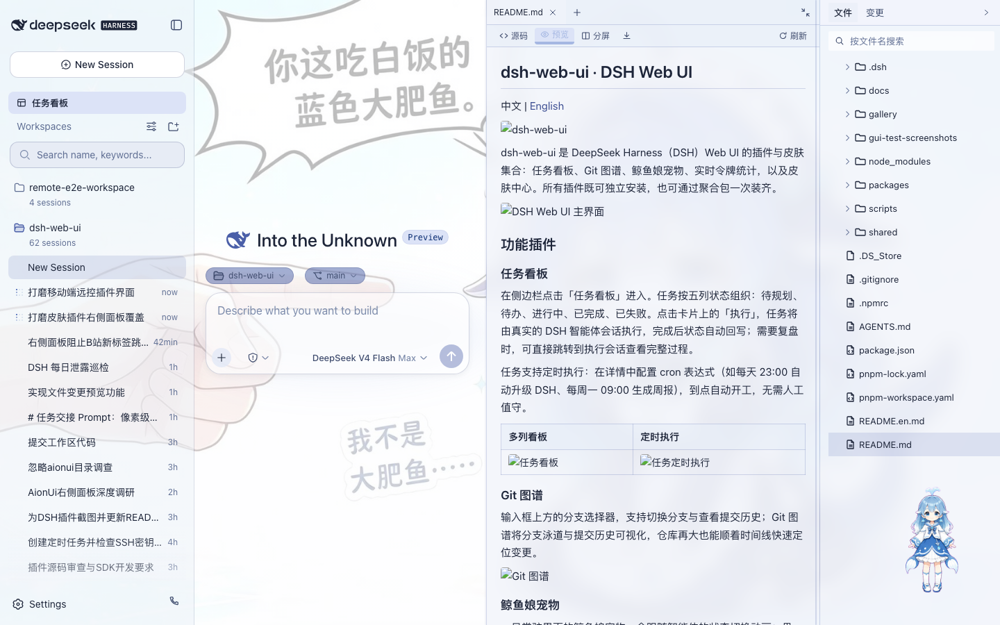
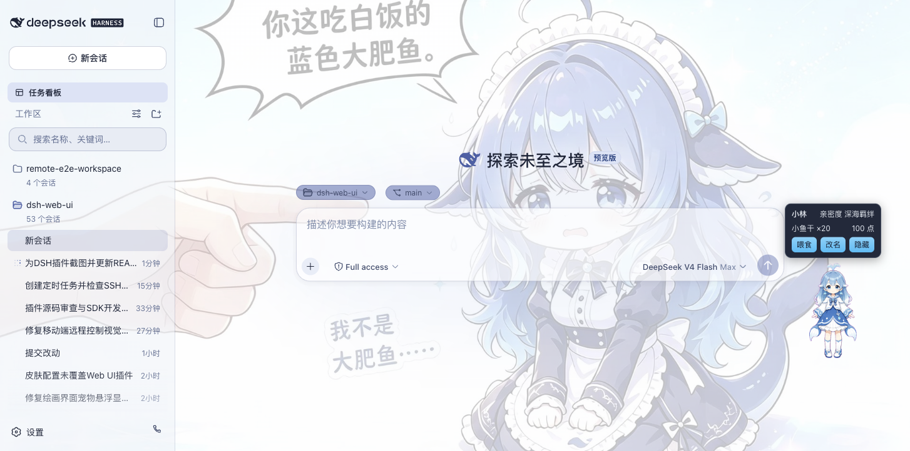
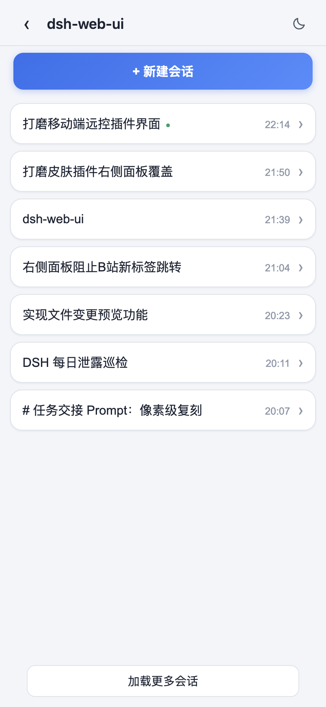
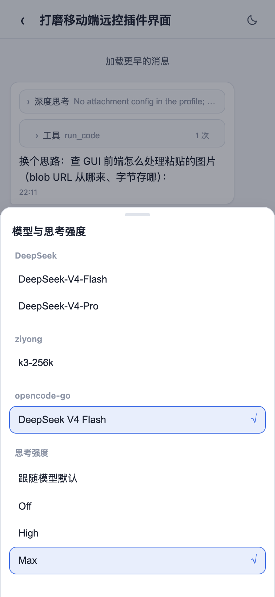
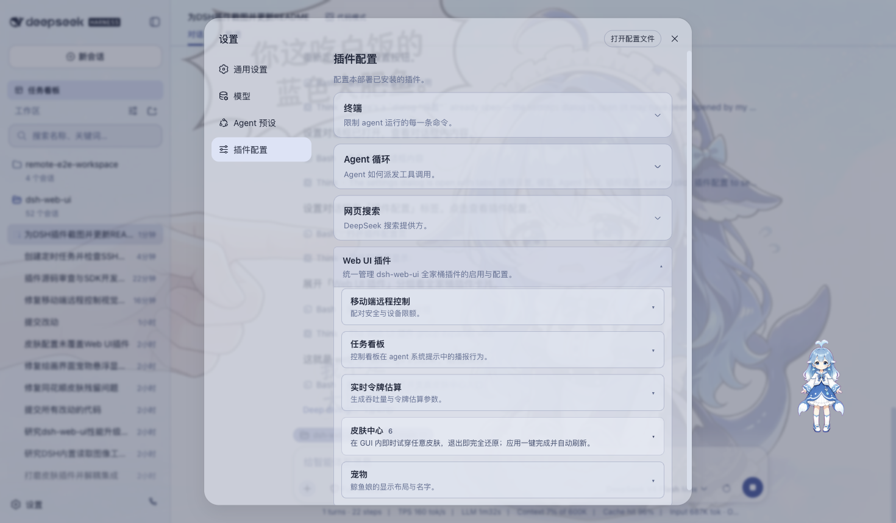

# DeepSeek Harness Desktop

中文 | [English](README.en.md)



## 跨平台桌面版

DeepSeek Harness Desktop 将原版 DSH Web 界面完整装进 Windows 和 macOS 应用：不是重写页面，而是用安全的 Electron 窗口启动官方 `@deepseek-ai/dsh` 本地主机，再加载本仓库的桌面扩展。发布流程分别生成 Windows x64、macOS Intel 和 macOS Apple Silicon 安装包。

[下载最新安装包](https://github.com/jerry-yu95/deepseek-harness-desktop/releases/latest) · [安装指南](docs/install.md) · [桌面版技术说明](docs/desktop.md) · [更新日志](CHANGELOG.md)

当前开发版本：`0.1.38`。本版本补齐服务方 MCP JSON 与本地 `mcp.json` 安全导入、官方 Skill 包校验安装，以及连接器过期、撤销、断开、重连和可信分级；没有真实账号脱敏证据的连接器仍明确标为实验性。

## 为什么做这个项目

DeepSeek Harness 的价值不只是一套聊天界面，而是一套可以组合模型、工具、权限、Skills、工作流和插件的 Agent 运行底座。本项目不另造一套 Agent Runtime，而是在官方机制之上补齐普通用户真正会遇到的产品缺口：可安装、可理解、可扩展、可远程、可观察、可恢复。

- **官方底座不魔改**：保留官方 Agent Loop、Cordis、权限和插件语义，官方内核更新与社区桌面版本分轨管理；
- **扩展中心**：把 Skills、MCP/HTTP 连接器和学习入口放进官方侧边栏，创建、导入、诊断与移除都在一个地方完成；
- **连接器优先复用官方 JSON**：自动查找 WorkBuddy、CodeBuddy、TRAE、Qoder 本地 MCP 配置，也支持粘贴服务商提供的 `mcpServers` JSON，只补缺少的令牌；
- **Agent Harness 增强层**：标准、自适应和增强编排可切换，缓存命中、Agent 轨迹、模型健康与 Token 周期统计可观察；
- **真实桌面交付**：支持 Windows x64、macOS Intel 和 Apple Silicon，并提供配置隔离、更新备份与失败回退；
- **开源边界清楚**：社区增强不会冒充 DeepSeek 官方能力，第三方代码和上游来源保留许可与署名。

本项目的核心定位是“官方 Harness 运行时之上的开源 Agent 工作台”：保留 DeepSeek Harness 的执行语义，同时把连接器、Skills、编排、缓存、远程控制、可观测性和跨平台交付做成普通用户可以理解、安装和验证的产品能力。

| 原版界面无损加载 | 桌面扩展坞 |
| --- | --- |
|  |  |

- 保留任务看板、Git 图谱、右侧面板、SSH、移动端远程、实时统计、宠物与自定义皮肤；
- 独立 `desktop` profile，不覆盖既有 DSH 配置，运行时仅监听回环地址；
- 内置崩溃恢复、日志脱敏与轮转、窗口状态恢复、严格导航与权限策略；
- 扩展中心支持 Skills 创建/导入、官方 MCP JSON、外部客户端配置发现、连接器诊断，以及社区 DSH bundle 安装/回滚；
- 安装包自带官方 DSH、pnpm 与原生依赖，无需另外安装 Node.js。

## 扩展中心

侧边栏的「技能」「连接器」「学习」是社区桌面插件提供的统一入口：

- **技能**：查看 Harness 已发现的 Skill，创建合规的 `SKILL.md`，或导入现有技能目录。Skill 是给 Agent 的专业操作手册，不等同于 MCP 或 Cordis 插件；
- **连接器**：使用 GitHub、飞书/Lark、GitLab 等官方 MCP 模板，粘贴任意官方 `mcpServers` JSON，或一键发现 WorkBuddy、CodeBuddy、TRAE、Qoder 的本地配置；
- **学习**：用通俗产品语言理解 Harness 五层结构、权限、模式、插件边界，以及本项目每项社区增强背后的设计取舍。

当前连接器目录会明确区分“官方 MCP 模板”“服务方 JSON 配置”“官方 Skill”和“API/OAuth 指引”。目录中的来源核验不等同于真实账号授权已完成，应用会把配置、凭证、运行时和 Harness 注册状态分开诊断。

凭证只在桌面主进程加密保存，不写入连接器记录、生成的 profile、日志或导出 JSON。连接器诊断会分别显示配置、凭证、运行时和 Harness 注册状态，避免只给一个无法行动的“连接失败”。

当前公开构建未使用付费代码签名证书，Windows SmartScreen 或 macOS Gatekeeper 可能显示未知发布者。请只从本项目 Releases 下载并核对 SHA-256。Windows 支持应用内更新；macOS 会检测新版并打开本项目 Release 页，由用户手动安装。具体步骤见[安装指南](docs/install.md)。

本仓库同时维护 DeepSeek Harness（DSH）Web UI 扩展集合：任务看板、Git 图谱、右侧面板、移动端远程、远程连接、鲸鱼娘宠物、实时令牌统计和自定义图片皮肤。桌面安装包已经包含这些能力；以下独立插件说明面向已有 DSH 环境的开发者。


## 功能插件

### 任务看板

在侧边栏点击「任务看板」进入。任务按五列状态组织：待规划、待办、进行中、已完成、已失败。点击卡片上的「执行」，任务将由真实的 DSH 智能体会话执行，完成后状态自动回写；需要复盘时，可直接跳转到执行会话查看完整过程。

任务支持定时执行：在详情中配置 cron 表达式（如每天 23:00 自动升级 DSH、每周一 09:00 生成周报），到点自动开工，无需人工值守。

| 多列看板 | 定时执行 |
| --- | --- |
|  |  |

### Git 图谱

输入框上方的分支选择器，支持切换分支与查看提交历史；Git 图谱将分支泳道与提交历史可视化，仓库再大也能顺着时间线快速定位变更。



### 右侧面板

项目会话打开时，聊天区右侧出现「预览」与「文件/变更」两块面板：

- **文件树**：浏览工作目录，点击文件即在预览面板打开，整行点击展开文件夹，支持按文件名搜索定位；
- **预览**：多标签预览 markdown、HTML、代码、diff、CSV、PDF、Office、图片与文本等格式，支持源码 / 预览切换、分屏编辑与保存；
- **变更（SCM）**：真实 git 变更面板，支持 stage / unstage / discard；
- 面板宽度可拖拽调整，双击把手复位默认宽度，折叠状态与宽度按项目持久化；
- 自定义图片皮肤会统一适配右侧面板，并自动维持文字对比度。



### 鲸鱼娘宠物

一只常驻界面的鲸鱼娘宠物，会跟随智能体的状态切换动画：思考、等待、工作、庆祝。点击可互动（摸头），投喂小鱼干可提升亲密度，陪伴度从幼鲸一路成长至「深海羁绊」。支持自定义名称、自由拖动位置，也可随时隐藏。

| 陪伴工作 | 互动面板 |
| --- | --- |
|  |  |

### 实时令牌统计

在输入框下方实时显示生成速度（TPS）、LLM 耗时、上下文占用、缓存命中率以及输入 / 输出 token 数，每次生成的用量一目了然。


### 移动端远程

侧边栏底部的手机图标打开配对面板：扫码配对（或复制链接）后，手机进入独立的移动端界面，远程控制当前 dsh web 工作区——查看与新建会话、收发消息、切换模型与思考强度、调整权限预设，全部与桌面端同步。配对令牌一次性且限时，「停止」可随时吊销所有设备；二维码默认走局域网，也可开启 cloudflared 公网隧道，让手机在任意网络配对。

| 工作区列表 | 会话列表与新建会话 |
| --- | --- |
|  |  |
| 聊天（折叠的深度思考与工具调用） | 模型与思考强度选择 |
|  |  |

### 远程连接

侧边栏「SSH」入口打开远程运维面板。主机支持密钥 / 密码认证，可从 `~/.ssh/config` 一键导入；配置统一存于 `~/.dsh/dsh-ssh.json`。对已配置主机可执行真实操作：

- **Web 终端**：xterm.js 远程终端，实时输出、随窗口自适应；
- **文件传输**：SFTP 上传 / 下载，带进度条与远程目录浏览；
- **端口转发**：本地隧道直达远程内网服务（数据库、API、管理后台），仅监听 127.0.0.1；
- **集群执行**：一条命令并发跑多台主机，按别名 / 环境 / 标签过滤；
- **Agent 直连**：Agent 与面板共享同一份主机配置，对话中直接说「连一下 xxx 看看状态」即可由智能体执行远程命令。

### 设置中心

全部插件的开关与参数统一收纳于「设置 > 插件配置」，修改即时生效。



## 自定义皮肤

桌面版不再默认启用易导致可读性问题的预设皮肤。在「设置 → 插件配置 → Web UI 插件 → 自定义皮肤」中上传图片后，应用会自动生成亮/暗色配色、对比度与背景遮罩，并可调整图片可见度或一键恢复官方外观。图片与主题配置只保存在本机。

## 安装

DSH 插件通过 `dsh plugin` 命令安装进 **profile**（`dsh web` 对应 `web` profile）。推荐直接安装聚合包 `dsh-web-ui-all`——一个包装齐全部功能插件与皮肤；只想用皮肤则装 `dsh-skins`。

### 方式一：从 npm 安装（推荐）

插件已发布到 npm（`@linxin666` scope），一条命令装齐：

```sh
dsh plugin --profile web add @linxin666/dsh-web-ui-all
```

装完重启 `dsh web`，侧边栏即可看到全部插件入口。只想用皮肤则装 `@linxin666/dsh-skins`。

> 首次安装若提示 `ERR_PNPM_IGNORED_BUILDS`（pnpm 拒绝依赖的构建脚本），按提示把 `cloudflared` / `cpu-features` / `ssh2` 加入 profile 的 `pnpm-workspace.yaml` `allowBuilds` 后重新执行即可。

### 方式二：从 GitHub 仓库安装（改代码调试）

插件包已在 npm 发布，仓库安装仅供开发调试（需要 Node.js >= 22 与 pnpm）：

```sh
# 1. 克隆仓库
git clone https://github.com/jerry-yu95/deepseek-harness-desktop.git
cd deepseek-harness-desktop

# 2. 安装依赖并构建
pnpm install
pnpm -r build

# 3. 把全家桶链接进 web profile（推荐，先链接全部子包再注册聚合包）
node scripts/link-profile.mjs
dsh plugin --profile web add link:$(pwd)/packages/dsh-web-ui-all

# 4. 重启 dsh web，侧边栏即可看到全部插件入口
dsh web
```

> 只想用皮肤：第 3 步只执行 link-profile 后安装 `packages/dsh-skins` 即可。
>
> 注意：profile 目录不是 pnpm workspace，聚合包里的 `workspace:*` 依赖会回退拉取 npm 已发布版本；
> 若 npm 版本滞后或损坏会出现「宿主已挂载但 UI 不显示」，此时先用 `node scripts/link-profile.mjs`
> 让全部子包走仓库构建产物。

### 单独安装某个插件

不想装全家桶时，可单独安装任意插件（npm 已发布，直接用包名）：

```sh
dsh plugin --profile web add @linxin666/dsh-client-ui-task-board   # 任务看板
dsh plugin --profile web add @linxin666/dsh-ssh                    # 远程连接（SSH）
dsh plugin --profile web add @linxin666/dsh-pet                    # 鲸鱼娘宠物
```

### 验证与卸载

安装成功后重启 `dsh web`，侧边栏出现对应入口即生效；也可用 `dsh --profile web --dump-config` 确认插件配置层已挂载。若侧边栏没有新入口，多半是安装后没有重启 `dsh web`。

卸载：`dsh plugin --profile web remove @linxin666/dsh-web-ui-all`，然后重启 `dsh web`。

技术细节见 [docs/plugins.md](docs/plugins.md)。

## 来源与版权

| 包 | 来源 | 版权 |
| --- | --- | --- |
| dsh-task-board / dsh-git-graph / dsh-aionui-panel / dsh-pet / dsh-remote-web-ui / dsh-live-stats / dsh-web-ui-settings / dsh-skins / dsh-web-ui-all / skins | 作者 zhu1090093659 个人开发 | BSD-3-Clause（zhu1090093659） |

迁入第三方代码必须保留 LICENSE 与署名；活跃且有上游的第三方优先 fork 或依赖引用，不搬代码。

## 友情链接

- 本项目积极参与并认可 [LINUX DO 社区](https://linux.do)。
